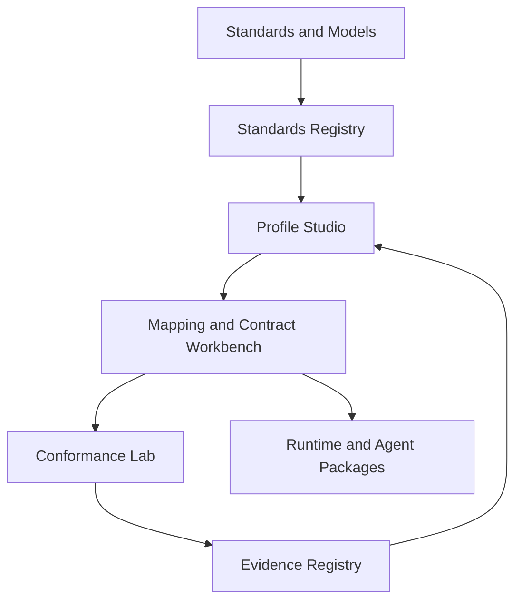

# SIEL Unified Platform Blueprint

## 1. Platform purpose

The SIEL Unified Platform turns fragmented standards into testable Industry Interoperability Profiles that can be used by applications, data platforms and AI agents.

It is not a replacement for source standards or systems of record. It is a standards-aware control plane for discovery, profiling, mapping, validation and evidence.

## 2. Core value proposition

> Discover what exists, select what is authoritative, implement only what the use case needs, and publish evidence of whether it works.

## 3. Platform architecture



## 4. Platform modules

### 4.1 Standards Registry

Provides a searchable, versioned catalogue of standards, ontologies, schemas, APIs, reference models, regulatory collections and open-source implementations.

Minimum capabilities:

- classification by industry, use case and artifact type;
- steward, licence and access metadata;
- version and deprecation tracking;
- relationship and overlap graph;
- source verification date;
- maturity and evidence status;
- machine-readable registry API; and
- alerts for upstream change.

### 4.2 Industry Profile Studio

Creates a minimal profile for a defined operational problem.

Minimum capabilities:

- use-case definition and baseline;
- participants and authority mapping;
- selection of existing standards;
- minimum concept and event scope;
- local extension rules;
- jurisdiction and regulatory overlays;
- profile versioning; and
- architecture decision records.

The output is an **Industry Interoperability Profile**.

### 4.3 Semantic Mapping Workbench

Maps source systems and standards to the selected profile.

Minimum capabilities:

- schema and metadata ingestion;
- terminology and ontology lookup;
- deterministic and AI-assisted candidate mapping;
- exact, broader, narrower, conditional and derived relationships;
- confidence and evidence recording;
- reviewer workflow;
- conflict and ambiguity management;
- approved mapping registry; and
- change-impact analysis.

AI suggestions must remain proposals until an accountable reviewer approves them.

### 4.4 Contract and Policy Workbench

Packages semantic requirements with operational and governance conditions.

Minimum capabilities:

- Open Data Contract Standard compatibility;
- schema and event definitions;
- data quality and service expectations;
- owner, producer and consumer roles;
- permitted purpose and prohibited use;
- retention and jurisdiction rules;
- privacy and consent references;
- security classification; and
- policy decision points for runtime enforcement.

### 4.5 Agent Context Compiler

Produces bounded, machine-readable context for AI agents.

Outputs may include:

- concept definitions and identifiers;
- relationships and constraints;
- approved examples;
- provenance and authority;
- temporal validity;
- policy and permitted actions;
- known ambiguity;
- mapping confidence;
- escalation rules;
- JSON-LD contexts;
- SHACL shapes;
- retrieval packages; and
- tool or API descriptions.

The compiler must distinguish authoritative rules from explanatory content and probabilistic suggestions.

### 4.6 Conformance Lab

Runs reproducible tests against standards, profiles, source mappings and runtime packages.

Minimum capabilities:

- synthetic and authorised test datasets;
- positive and negative fixtures;
- schema and SHACL validation;
- contract testing;
- API and event testing;
- round-trip transformation tests;
- semantic-loss detection;
- policy enforcement tests;
- AI mapping benchmarks;
- regression testing; and
- cross-vendor portability testing.

### 4.7 Evidence Registry

Publishes what was tested, under which conditions, and with what result.

Minimum capabilities:

- immutable test-run identifier;
- profile, source and tool versions;
- dataset classification;
- measures and thresholds;
- failed and disputed mappings;
- reviewer and conflict-of-interest declarations;
- reproducibility instructions;
- signed result artefacts;
- evidence maturity level; and
- explicit limitations.

### 4.8 Developer and Community Portal

Supports adoption and contribution.

Minimum capabilities:

- human-readable documentation;
- registry search;
- downloadable profile packages;
- examples and quick starts;
- conformance dashboards;
- issue and proposal workflows;
- working-group spaces;
- release notes; and
- implementation case studies.

## 5. Platform control planes

### Governance control plane

- authority and stewardship;
- decision records;
- contribution provenance;
- conflicts of interest;
- version approval;
- deprecation; and
- right to publish negative findings.

### Security and privacy control plane

- identity and access control;
- tenant and project isolation;
- data classification;
- consent and purpose controls;
- secrets management;
- audit logging;
- secure deletion;
- threat modelling; and
- supply-chain security.

### Evidence control plane

- experiment registration;
- reproducible test configuration;
- metric definitions;
- evidence signing;
- independent review; and
- maturity scoring.

## 6. Industry Interoperability Profile package

Each released profile should contain:

```text
profile/
├── profile.yaml
├── README.md
├── sources/
│   └── standards-register.yaml
├── semantics/
│   ├── context.jsonld
│   ├── shapes.ttl
│   └── vocabulary-mappings.yaml
├── contracts/
│   ├── data-contract.yaml
│   ├── api.yaml
│   └── events.yaml
├── policy/
│   ├── permitted-use.yaml
│   └── security-classification.yaml
├── mappings/
│   ├── source-a.yaml
│   └── source-b.yaml
├── fixtures/
│   ├── valid/
│   └── invalid/
├── tests/
├── evidence/
└── decisions/
```

Not every profile requires every technical format. The manifest must identify which artifacts are normative, informative or not applicable.

## 7. First higher education profile

### Recommended use case

**Credit transfer and recognition of prior learning**

This use case crosses admissions, student records, curriculum, learning outcomes, credentials, evidence, decisions and regulatory reporting.

### Candidate source standards

- CAUDIT HERM for capability and conceptual alignment;
- 1EdTech Edu-API for academic enterprise exchange;
- 1EdTech CASE for competencies and learning outcomes;
- PESC for transcripts and academic records;
- European Learning Model for qualifications and credentials;
- EMREX for academic-result exchange patterns;
- Open Badges and CLR for portable achievements;
- TCSI for Australian reporting definitions;
- AVETMISS for Australian VET reporting;
- AQF and institutional policy for qualification and credit rules; and
- W3C Verifiable Credentials for portable evidence where appropriate.

### Pilot questions

1. Can a minimum profile express a credit application without imposing a complete institutional data model?
2. Can transcripts and credentials from different standards be normalised without losing meaning?
3. Can AI propose course and outcome mappings while preserving human academic authority?
4. Can every decision be traced to evidence, policy and approved mappings?
5. Can the profile support both higher education and VET without hiding material differences?
6. Can Australian reporting concepts be linked without turning a reporting collection into an operational model?

## 8. Differentiation from existing initiatives

| Capability | Typical existing initiative | SIEL Unified Platform |
|---|---|---|
| Define a domain vocabulary | Often | Reuses and profiles existing vocabularies |
| Define an API or exchange format | Often | Selects and tests formats for a use case |
| Provide source-to-standard mappings | Sometimes | Maintains reviewed, versioned mapping records |
| Compare competing standards | Rarely | Core function |
| Record licensing and availability | Inconsistently | Mandatory registry metadata |
| Generate agent-ready context | Emerging | Core packaged output |
| Separate AI proposal from approval | Rarely | Mandatory control |
| Publish negative results | Rarely | Governance requirement |
| Measure implementation effort and change cost | Rarely | Standard evidence dimensions |
| Connect semantics, contracts, policy and tests | Inconsistently | Unified profile package |
| Cross-industry evidence model | Rarely | Shared conformance and maturity framework |

## 9. Missing capabilities to add to the initiative

The current charter should be extended with the following capabilities.

### 9.1 Machine-readable standards registry

The landscape cannot remain only in Markdown. Add a governed YAML or JSON registry with automated link, version and licence checks.

### 9.2 Authority model

Define who may approve meanings and mappings. Technical maintainers cannot approve regulatory, clinical, academic or financial semantics without delegated authority.

### 9.3 Semantic decision records

Architecture decision records are not enough. Add a dedicated record for disputed definitions, mapping rationale and consequences.

### 9.4 Jurisdiction overlays

Separate global semantics from jurisdiction-specific rules. Australia, Europe, the United States and other jurisdictions must be versioned as overlays rather than mixed into one model.

### 9.5 Temporal semantics

Definitions, policies and mappings change over time. Every normative artifact needs effective dates, supersession and historical interpretation.

### 9.6 Identity resolution

The platform needs explicit treatment of identifiers, matching, survivorship, aliases and crosswalks for people, organisations, assets and credentials.

### 9.7 Privacy, consent and Indigenous data governance

Profiles should include privacy purpose, consent, community authority and relevant Indigenous data-sovereignty considerations from the beginning.

### 9.8 Semantic security

Threat models must include ontology poisoning, malicious mappings, prompt injection through metadata, policy bypass, evidence tampering and compromised upstream standards.

### 9.9 Sustainability model

Define how profiles are maintained, who pays for stewardship, how abandoned modules are archived and how implementers can rely on release continuity.

### 9.10 Adoption and value metrics

Measure more than technical conformance. Include implementation time, avoided mapping effort, maintenance cost, vendor portability, decision quality and operational benefit.

### 9.11 Accessibility and multilingual support

Definitions, documentation and human review interfaces should support accessibility and multilingual industry contexts.

### 9.12 Standard-to-standard mapping benchmark

Create a public benchmark for deterministic and AI-assisted ontology and schema mapping, including ambiguous, adversarial and jurisdiction-sensitive cases.

## 10. Recommended delivery sequence

### Phase 1: Registry and templates

- machine-readable standards registry;
- licence and availability taxonomy;
- Industry Interoperability Profile manifest;
- semantic mapping record;
- evidence record; and
- conformance rubric.

### Phase 2: Higher education pilot

- credit-transfer profile;
- two synthetic SIS structures;
- transcript and credential mappings;
- TCSI and AVETMISS overlays;
- AI-assisted mapping workflow; and
- public evidence report.

### Phase 3: Second industry validation

Select an asset-intensive industry such as real estate, energy or manufacturing to determine whether the platform generalises beyond education.

### Phase 4: Reference platform

- searchable registry;
- profile studio;
- mapping workbench;
- automated conformance runner;
- evidence dashboard; and
- agent context package generation.

## 11. Success test

The platform succeeds only if an independent organisation can:

1. discover applicable standards;
2. understand reuse and licensing constraints;
3. assemble a minimal profile;
4. map two different source systems;
5. run reproducible tests;
6. identify semantic loss and policy conflicts;
7. publish evidence; and
8. maintain the implementation through an upstream change.

If the platform only produces another conceptual model, it has failed its purpose.

