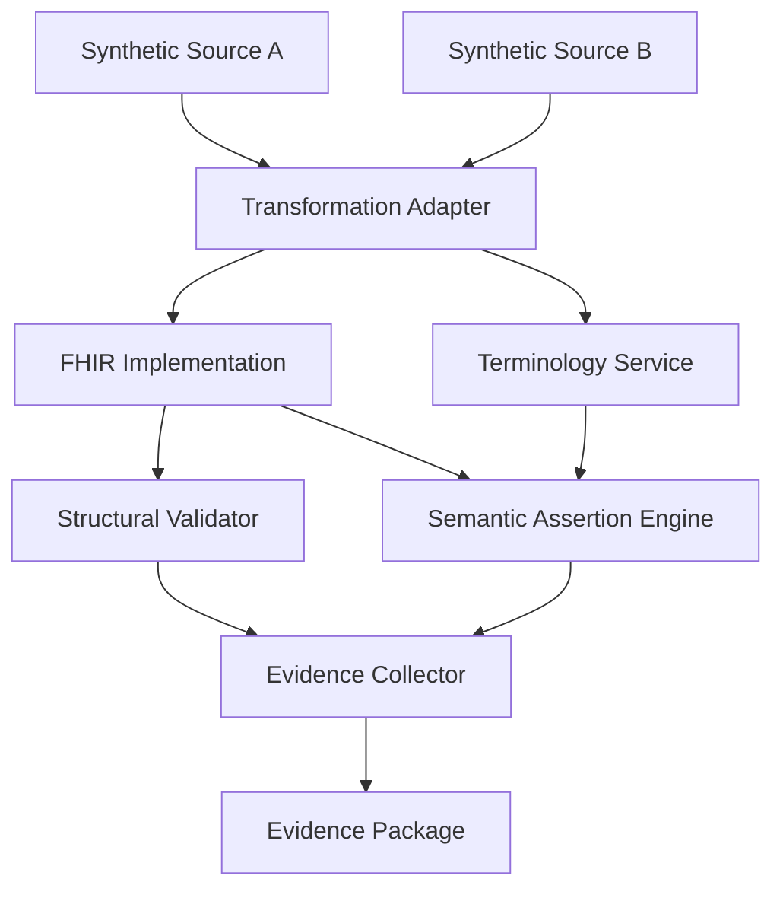

# Reference Architecture

## Purpose

The reference architecture defines how synthetic source data, transformations, validators, terminology services and evidence artifacts interact.

It is a benchmark architecture, not a production healthcare deployment.

## Logical architecture

## Components

### Synthetic source generators

Produce reproducible source messages and records using fixed configurations and seeds.

Responsibilities:

- generate valid source structures;
- generate controlled invalid and ambiguous variants;
- use clearly fictional identifiers;
- preserve generation provenance; and
- support exact fixture regeneration.

### Transformation adapters

Convert a declared source format into the target FHIR profile.

An adapter may use an existing integration engine, a vendor platform or a thin benchmark implementation.

Responsibilities:

- preserve source values;
- apply declared mappings;
- record transformations;
- return unresolved cases;
- generate provenance; and
- expose errors without silently discarding data.

### FHIR implementation

Stores, validates or processes target resources.

The benchmark should begin with HAPI FHIR and one managed FHIR implementation, subject to access and cost approval.

### Terminology service

Provides code validation, value-set expansion, lookup and mapping support.

Terminology content and versions must be pinned. Restricted content must not be redistributed through benchmark artifacts.

### Structural validator

Tests conformance with FHIR, profiles, cardinalities, invariants and declared value-set bindings.

### Semantic assertion engine

Tests expected meaning beyond structural validity.

Examples:

- approved test identity;
- correct unit and conversion;
- preserved specimen;
- preserved status;
- reference-range applicability;
- amendment history;
- source-value retention; and
- transformation provenance.

### Evidence collector

Combines structural, terminology, semantic and portability results with execution metadata.

## Trust boundaries

| Boundary | Main risk | Required control |
|---|---|---|
| Fixture ingestion | Real or restricted data enters the benchmark | Synthetic-data declaration and automated scanning |
| Adapter execution | Hidden transformation or external transmission | Pinned code, network policy and execution logging |
| Terminology access | Restricted content is redistributed | Licence-aware caching and external references |
| Managed platform | Synthetic data leaves the local environment | Approved test data and account configuration |
| Evidence export | Logs disclose sensitive partner information | Output filtering and review |
| AI service | Fixture or prompt is retained externally | Approved service terms and synthetic-only input |

## Deployment modes

### Local open-source mode

- local synthetic fixtures;
- local adapter;
- local HAPI FHIR;
- permitted terminology services;
- local test runner;
- local evidence output.

This is the preferred reproducible baseline.

### Managed-platform mode

- same released fixtures;
- platform-specific adapter and configuration;
- managed FHIR endpoint;
- identical semantic assertions;
- platform-specific deviation record.

### Partner-local mode

- benchmark executes inside the partner boundary;
- partner data is not copied to SIEL;
- external network access is disabled by default;
- only reviewed evidence output is shared.

## Reproducibility requirements

- container or equivalent environment definition;
- pinned dependency versions;
- fixed seeds;
- configuration checksums;
- no hidden manual correction;
- complete command sequence;
- machine-readable results; and
- human-readable summary.

## Security baseline

The synthetic public benchmark should still apply:

- least privilege;
- no committed secrets;
- dependency scanning;
- signed or checksummed releases;
- isolated test environments;
- controlled network access;
- audit logs;
- safe error handling; and
- documented cleanup.

These controls support trustworthy evidence even when no patient data is present.
